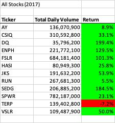
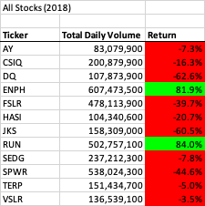
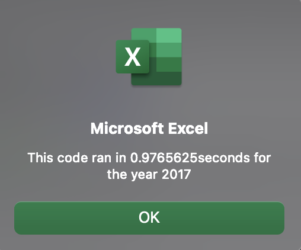
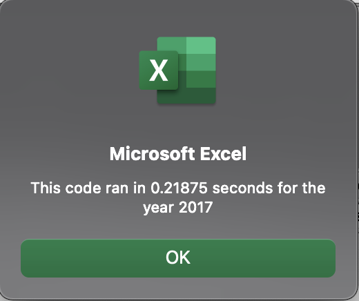
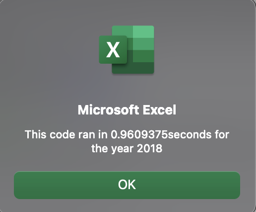
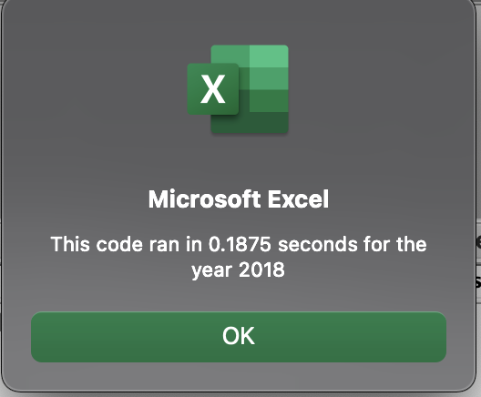

# Stock-Analysis and VBA_Challenge

## Project Overview

The purpose of this project is to quickly construct a series of macros using VBA to analyze stock performance and provide insight to the client to assist his parents in assessing the best stocks to purchase and examine his parents preferred stock DQ.  VBA codes and macros were used to evaluate multiple stocks and look at yearly returns for 2017 and 2018, from start to finish.  An output sheet with formatting and quick buttons to run and clear the macros were provided.

Code was then refactored using VBA script from the module to make it run more efficiently.  This will allow it to save time and perform faster than the simple initial VBA code. Performance improvement were captured with a timer.  Additionally output tables were compared from the original module and the refactored code to make sure the value outputs matched.

### Results

The stock analysis project is located here:
[Vba_Challenge](Test).  On the worksheet, All Stocks Analysis, there are three buttons to run the analysis on the stock data provided.  First, utilize the clear button to clear any previous runs.  Two buttons are included to run the original code and the refactored code.  As we will see the refactor code is more efficient and that button should be used.  After depressing the All Stock Analysis refactored code button, the user will be prompted to enter the year for the analysis.  The data provided includes 2017 and 2018 data.  Figures 1 and 2 show the stock returns for 2017 and 2018 as outputs from the Vba code.  As you can see in figure 1 all but one stock had a positive return.  The DQ stock in particular had an outstanding performance in 2017.  However, in 2018 (Figure 2) we see that the returns are negative for all but two stocks.  The stocks with ticker ENPH and RUN are the only stocks that have positive returns two years in a row.  ENPH in particular has strong returns both years.  RUN's stock performance while positive in 2018 was only 5.5%.  DQ's stock had a performance collapse in 2018 giving up 62.5%.  Based on the two years of data ENPH's returns are much better than DQ's return.  The output tables for both 2017 and 2018 are the same regardless of the original or refactored macro being used suggesting that refactoring is not changing the outcome.

Fig 1 

Fig 2 

In examining the overall performance of the refactored code, figures 3-6 reflect the time the code took to execute and calculate its solution.  As seen in the screen captured figures, the refactored code outperforms the original code in both year (2017 and 2018).  The performance increase is 4-5 times faster than the original code. For such a small dataset this time savings is only 0.7-0.8 seconds.  This time savings is not likely perceptible to the user but as additional years and or stocks lines of data are added these savings will become more apparent.  Most of the savings likely comes from the efficiencies of refactoring the code.  An example of this is in the code here:
'If Cells(j, 1).Value = tickers(tickerIndex) And Cells(j + 1, 1).Value <> tickers(tickerIndex) Then
 tickerIndex = tickerIndex + 1
 End If'
This IF Then statement stops the loop and restarts the loop on the next ticker without examining every line of data thereby speeding up the performance.

Fig 3 

Fig 4 

Fig 5 

Fig 6 

### Summary

#### Question 1

Advantages to refactoring code are that it runs more efficiently and saves computing resources and outputs are delivered faster.  Although the improvements in this project are slight as seen in the results, if the datasets grow larger a code that runs 4 -5times faster becomes much more efficient and useful.
 
Disadvantages are two-fold.  The time to generate the refactored code might not ultimately be worth the effort.  If it take two hours to refactor the code and only saves half a second, the number of times you plan to run the needs to factor in to whether the refactoring time saves enough overall time.  Also refactoring could lead to errors if not don't correctly.  Your output may change if you are not careful.

#### Question 2
In this example, the time saved was negligible in absolute terms but the magnitude of the reudction was significant. See table below:

|Year|Original Code Time|Refactored Code Time|
|----|-----|-----|
|2017|0.976 Seconds|0.219 Seconds|
|2018|0.960 Seconds|0.188 Seconds|

The refactoring time in this case likely was not necessarily worth the time.  The original question was to review the performance of the 15 stocks and look at the other stocks compared to the DQ stock in question.  The simple original code ran that in under a second.  The refactoring time took longer than the three quarters of a second savings.  However if we were to expand the years and number of stocks in the dataset it may make up for the time spent.
